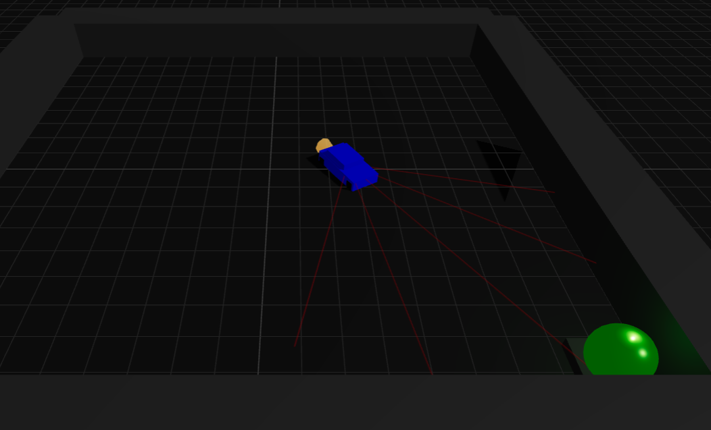
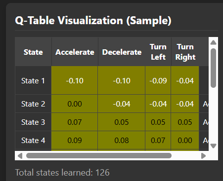
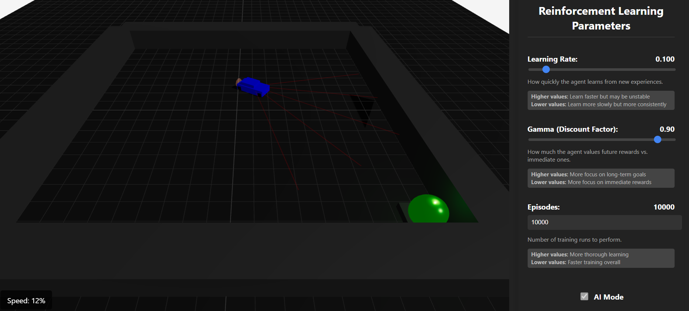

# Self-Driving Car Reinforcement Learning Simulation

## Table of Contents
- [Introduction](#introduction)
- [Features](#features)
- [Controls](#controls)
- [Reinforcement Learning Parameters](#reinforcement-learning-parameters)
- [How to Use](#how-to-use)
- [Technologies Used](#technologies-used)
- [Screenshots](#screenshots)
- [Contact](#contact)

## Introduction

This project is a self-driving car simulation that demonstrates reinforcement learning principles. The simulation allows users to switch between manual control and AI training mode, where a reinforcement learning agent learns to navigate to a goal position while avoiding obstacles.

Designed by Pejman Ebrahimi, this educational tool visualizes how different RL parameters affect learning behavior in a practical environment.

## Features

- Interactive 3D environment built with React Three Fiber
- Switch between manual control and AI training modes
- Adjustable reinforcement learning parameters
- Real-time visualization of Q-table and reward history
- Realistic car physics with natural controls
- Sensor system for environment detection
- Visual feedback for speed, acceleration, and braking

## Controls

### Manual Mode
- **Arrow Keys** or **WASD**: Control the car
  - Up/W: Accelerate
  - Down/S: Brake
  - Left/A: Turn left
  - Right/D: Turn right
- Car has realistic physics with:
  - Gradual acceleration and deceleration
  - Speed-dependent turning (less responsive at high speeds)
  - Inertia and momentum

### AI Mode
- Toggle "AI Mode" checkbox
- Click "Start Training" to begin the learning process
- Watch as the agent learns to navigate to the goal
- Adjust parameters to see how they affect learning

## Reinforcement Learning Parameters

- **Learning Rate (α)**: How quickly the agent updates its knowledge
  - Higher values: Faster learning but potentially unstable
  - Lower values: More stable but slower learning

- **Gamma (Discount Factor)**: How much the agent values future rewards vs. immediate ones
  - Higher values: More focus on long-term goals
  - Lower values: More focus on immediate rewards

- **Episodes**: Number of training runs to perform
  - Higher values: More thorough learning
  - Lower values: Faster overall training

## How to Use

1. Clone the repository
2. Install dependencies with `yarn install`
3. Start the development server with `yarn start`
4. Use the controls panel to adjust parameters
5. Switch between manual and AI modes
6. Press the "Reset" button to start over

## Technologies Used

- React.js
- Three.js / React Three Fiber
- JavaScript ES6+
- Reinforcement Learning (Q-Learning algorithm)

## Screenshots

*Manual Mode - Control the car using arrow keys or WASD*

*AI Training Mode - Watch the agent learn to navigate to the goal*

*Parameter Controls - Adjust learning parameters to see their effects*

## Contact

Designed and developed by Pejman Ebrahimi.

- Email: pejman.ebrahimi@uni.li
- LinkedIn: [Pejman Ebrahimi](https://www.linkedin.com/in/pejman-ebrahimi-4a60151a7/)
- Website: [arad1367.github.io/pejman-ebrahimi](https://arad1367.github.io/pejman-ebrahimi/)
- University: [University of Liechtenstein](https://www.uni.li/pejman.ebrahimi?set_language=en)
- Hugging Face: [arad1367](https://huggingface.co/arad1367)
